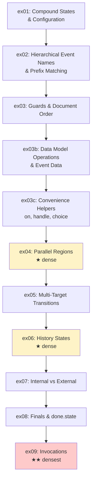
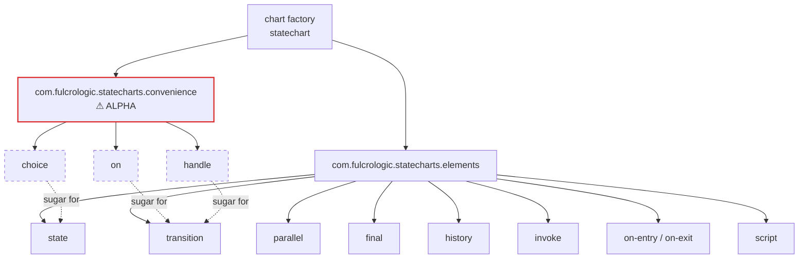
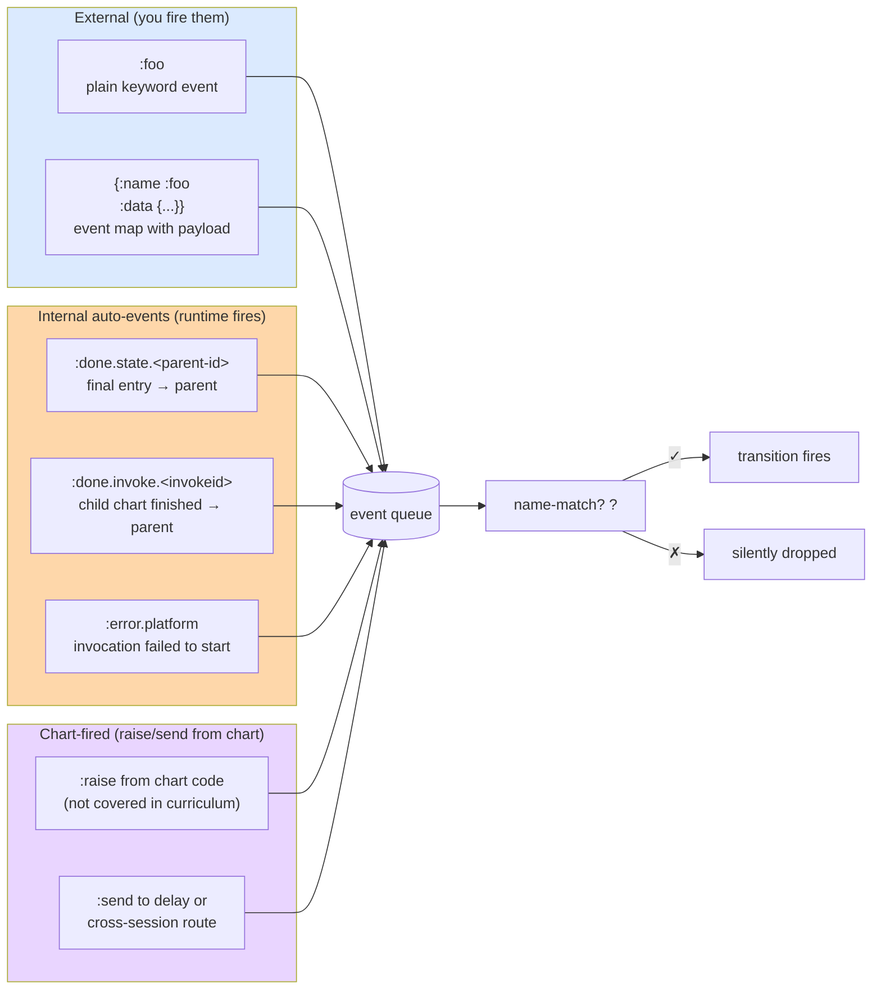
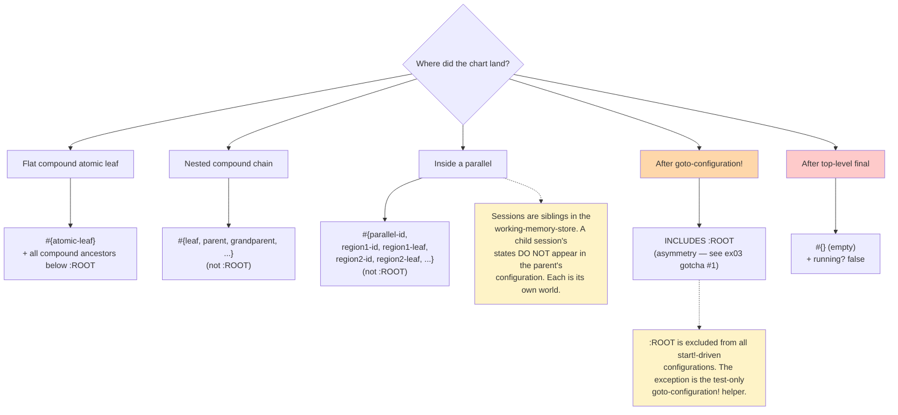
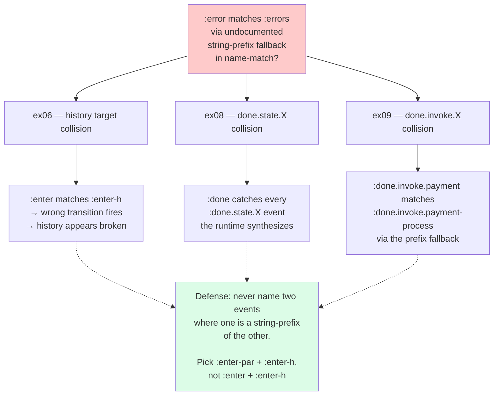
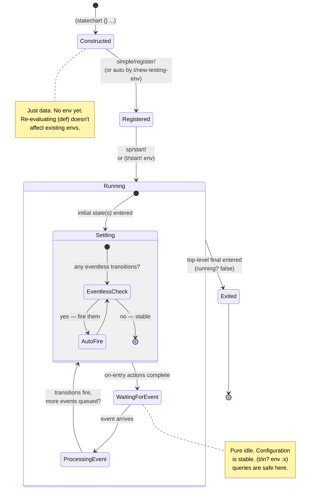

# Concepts Map — `com.fulcrologic/statecharts`

Visual references for how the curriculum's concepts compose. Six diagrams arranged from **simplest** (where to start) to **most complete** (the full picture). GitHub renders Mermaid inline, so all diagrams should display correctly when viewing on the web.

Reading suggestions by experience level:

- **First time through?** Read diagrams 1 and 2. Skip the rest until later.
- **Mid-curriculum, refreshing context?** Diagrams 3 and 4 ground specific exercises against the broader picture.
- **Post-curriculum or debugging in production?** Diagrams 5 and 6 are the precise ones.

---

## 1. Module learning path (simple)

The dependency order. ex01 first; everything else builds on it. The dense modules (ex04, ex09) are flagged so you can budget time.

The arrows are "what builds directly on what." You *can* read ex06 (history) before ex05 (multi-target) — they're parallel topics — but the curriculum's order keeps prior context fresh.

---

## 2. What concept lives where (simple)

A reverse lookup: "I'm stuck on a concept; which module introduces it?"

```mermaid
graph LR
    subgraph fundamentals["Fundamentals (ex01–ex03)"]
        state[state element]
        transition[transition element]
        configuration[configuration set]
        ancestor[ancestor walk]
        guard[guards / :cond]
        docorder[document order]
        datamodel[data model]
    end

    subgraph mid["Mid-level (ex03b–ex06)"]
        onentry[on-entry / on-exit]
        script[script element]
        handle[handle convenience]
        choice[choice convenience]
        parallel[parallel + regions]
        multi[multi-target<br/>:target vector]
        history[history shallow/deep]
    end

    subgraph advanced["Advanced (ex07–ex09)"]
        internal[":type :internal"]
        final[final element]
        donestate[done.state events]
        invoke[invoke element]
        doneinvoke[done.invoke events]
        childsession[child sessions]
    end

    fundamentals --> mid --> advanced

    style fundamentals fill:#dbeafe
    style mid fill:#fef3c7
    style advanced fill:#fecaca
```

Each box is a concept. Color = difficulty cluster. If you're hazy on `choice`, that's mid-level — ex03c.

---

## 3. Chart element family (simple-medium)

Every element you'll write in chart code, grouped by namespace.

**Solid lines** = part of the namespace's exports. **Dashed lines** = what the convenience helper expands to. The red border on `convenience` reflects its `"ALPHA. NOT API STABLE."` docstring — for long-lived production charts, prefer the elements namespace.

`choice` is special: it expands to a *state* (with eventless transitions inside), not a transition. That's why it's drawn under `state` in the dashed-link family.

---

## 4. Event types and where they come from (medium)

Every event the runtime can process, grouped by source.

The unifying insight: **every event flows through the same queue and matching logic**. Internal events aren't special at the matching layer — only their source differs.

Cross-reference: ex02's `name-match?` string-prefix footgun affects matching for ALL of these. ex06/ex08/ex09 gotchas track its cross-cutting damage.

---

## 5. Configuration set composition (medium-complex)

The question "what's in the configuration?" doesn't have a one-line answer — it depends on the chart's structure and how the chart was driven. This decision tree captures the rules.

The two surprise-prone rules are highlighted (orange): the `goto-configuration!` asymmetry, and chart-exit producing an empty configuration. Both bit during the curriculum's authoring; both are now documented.

---

## 6. The cross-cutting footgun (medium)

ex02's string-prefix matching fallback in `name-match?` — and where it bites in later modules. This is the most consequential bug pattern in the curriculum.

This is why ex02's gotcha #1 is the curriculum's single most cross-referenced footgun. Once you've seen `:done` match `:done.state.processing` in your own chart and spent an hour debugging, you remember the rule forever.

The bottom line: choose event names that are **full-segment-distinct** — never one being a string-prefix of another.

---

## 7. A statechart of the statechart lifecycle (bonus, meta)

Tongue-in-cheek but instructive: the lifecycle of a running statechart, modeled *as* a statechart. Uses Mermaid's `stateDiagram-v2` syntax.

What the meta-diagram surfaces:

- **The chart's life is broken into discrete event-processing cycles.** Between cycles, the configuration is stable and queries return consistent results.
- **The `Settling` sub-state captures the eventless-transition cascade** — the runtime keeps firing eventless transitions until no more are eligible. This is what makes choice (ex03c) "transient" — a single settling cycle passes through it.
- **Top-level final is the only way out.** A stuck chart (no transitions) stays in `Running > WaitingForEvent` indefinitely; only `Exited` distinguishes "truly done" from "stuck."

---

## How to use this document

- **First-time learning**: Read diagram 1 to pick a starting module. Read diagram 2 to know what's covered where.
- **Re-engagement**: Diagram 1 confirms the order; diagram 3 names the elements you have at your disposal.
- **Debugging your own chart**: Diagram 5 is the configuration-rules reference. Diagram 6 is the cross-module footgun cheat sheet.
- **Teaching someone else**: Diagrams 1–4 are good for whiteboarding the mental model; 5–7 are deep dives for after they've worked through 2–3 exercises themselves.

---

## When this document drifts

These diagrams are derived from the curriculum's modules and `ask_tony.md`. When you:

- Add a new module → update diagram 1 (the learning path) and diagram 2 (the concept inventory).
- Discover a new element or runtime behavior → update diagram 3, 4, or 5 depending on which.
- Add a cross-module footgun → update diagram 6.
- Find a new lifecycle wrinkle → update diagram 7.

Keep diagrams as small as the rules allow. A diagram that takes more than 30 seconds to read isn't doing its job.
